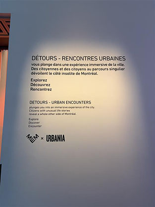
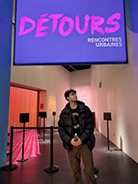
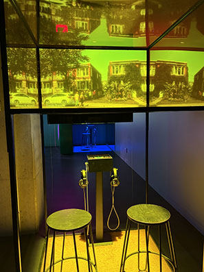
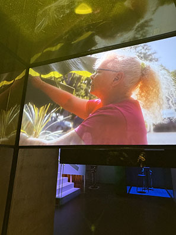
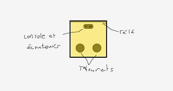
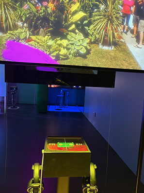
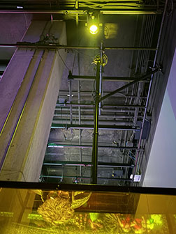
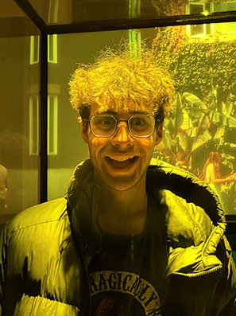

# Détours rencontres urbaines

## Lieu de l'exposition
L'exposition était situé au entre des mémoires montréalaises.

## Type d'exposition
C'est une exposition temporaire qui est en vigueur depuis Octobre 2023 et qui termine en Janvier 2027.

## Date de ma visite
J'ai visité l'exposition le 3 Mars 2026.

## Titre du dispositif
Le dispositif n'a pas de nom mais la personne qui est mise en valeur dans la vidéo s'appelle Lucie Hérard.

## Nom de la firme
Le centre des mémoires montréalaises a mis cette exposition en place grace à la firme URBANIA.

## Année de réalisation
l'exposition a été réalisé en 2023.

## Descriptif du dispositif
L'exposition que j'ai choisi parle d'une dame qui s'appelle Lucie Hérard, qui habite a Montréal et qui adore partager sa passion qui est de faire pousser des bananiers à Montréal.
Dans la capsule, elle explique comment faire pousser des bananiers a changé sa perspective sur la vie et sur son quartier. Selon elle tout le monde devrait avoir un bananier a la maison.

## Type d'installation
c'est une installation immersive selon moi, car les vitres jaunes, la lumière au plafond et les écouteurs m'ont vraiment permis d'entrer dans son monde avec elle.

## Fonction du dispositif
Selon moi la fonction de ce dispositif est de nous mettre en contexte le plus possible. Les vitres et la lumière de couleur jaune nous plongent vraiment dans son univers comme si ont voyais le monde à sa façon une fois de l'autre coté

## mise en espace

## Composantes et techniques
Pour réaliser ce dispositif, il a fallu;
- deux paires d'écouteurs
- une télévision
- une lumière au plafond qui diffuse une lueure jaune
- une base de métal d'environ deux mètres cubes avec des vitres jaune de chaque coté et au dessus
- la console électronique qui permet de choisir la langue

## Éléments nécessaires à la mise en exposition
Les éléments nécessaires étaient;
- un grand bras relié au plafond qui tiens la télévision
- un fil qui relie la télévision et qui se rend au plafond
- deux tabourets
- un tapis

## Expérience vécue
J'ai du me pencher pour pouvoir m'installer sur un tabourets, pour moi c'était une touche d'immersion car ça m'a fait imaginé que je passais sous un bananier. une fois en dessous je regarde autour de moi et tout est jaune, comme si j'étais une banane j'ai enfilé les écouteurs et j'ai commencé le visionnage. La lumière au plafond me faisait penser au soleil, je me croyais vraiment en plein été.

## Ce qui m'a plu
J'ai particulièrement aimé le fait que pour pouvoir tester le dispositif vous n'avez pas le choix de vous plonger dans la vie de Lucie et selon moi c'est une bonne manière de transmettre l'émotion d'une manière omnisciente. Le fait d'être plongé dans un environnement familier a celui de la vidéo donne l'impression que je suis avec Lucie dans son jardin sous un de ses bananiers.

## Aspect que je souhaite retenir pour mes créations
Dans mes créations, je veux absolument mettre quelque chose pour que les gens ne restent pas debout car selon la pire chose a faire quand tu es debout est d'endurer une vidéo et ne pas bouger pendant une dizaine de minutes. Je veux que les gens soient confortable pour qu'ils puissent ce concentrer sur le dispositif au lieu de leurs inconforts.

## Références
