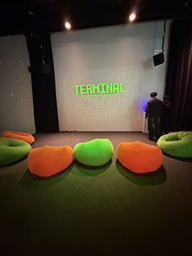
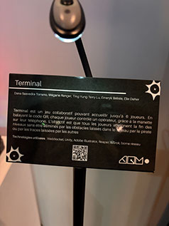

## Réseau vivant

## Collège Montmorency
## Type d'exposition
L'exposition était temporaire et elle avait lieu a l'intérieur dans le grand studio
## Date de ma visite
J'ai été voir l'exposition le 17 mars 2026
## Titre du dispositif
Le titre de ce dispositif est Terminal     

## Noms des créateurs
Dana Saavedra-Torrano, Mégane Ranger, Ting Yung Terry Lu, Émeryk Bélisle et Elie Daher
## Année de réalisation
L'exposition a été réalisé en 2025-2026
## Description du dispositif
     
Terminal est un jeux qui peux acceuillir jusqu'a 6 joueurs, le but du jeu est de collaborer et s'assurer que tout le monde se rende a l'endroit indiqué, le joueur controle son personnage et doit faire attention de ne pas passer la ou quelqu'un est déjà allé sinon il faut recommencer. le contenu est projeté au mur juste devant 6 poufs qui rendent le tout beaucoup plus amusant et confortable
## Type d'installation
C'est une installation qui est a la fois intéractive et immersive car non seuleumemt tu as le controle sur ce qu'il se passe mais il y a des projections et des lumières au dessus de nous qui viennent nous plonger dans ce monde cybernétique.
## Fonction du dispositif
## Mise en espace
https://pythons-5.github.io/Terminal/#/    

## Composantes et techniques
Voici la liste de composants affichés sur le github de Terminal  
Ordinateur principal sur chariot (1): PC de contrôle exécutant Unity, gère le jeu, les connexions et la projection.

Projecteur (1): Projection murale grand format pour afficher la zone de jeu commune.

Tablettes / phones (1-6): Contrôleurs utilisés par les joueurs (connexion Wi-Fi).

Routeur Wi-Fi (1): Permet la connexion des téléphones si le jeu est accessible via navigateur mobile.

Haut-parleurs amplifiés (2): Diffusion stéréo des sons du jeu pour renforcer l’immersion collective.

Sender / Receiver (1 chaque): Permet de connecter le cable video de l'ordinateur vers le projecteur.

Cables Ethernet (3 à 4): Connectez les matériaux à l'internet

Câbles vidéo (1): HDMI ou DisplayPort reliant le PC au projecteur.

Câbles audio (2): XLR pour relier la sortie audio aux haut-parleurs.

Câbles d’alimentation: Selon les haut-parleurs et le projecteur.

Multiprise / rallonge électrique – Pour alimenter l’ensemble du système.

Lumière plafond American DJ

Lumière Baton (2-4): Mettre de la lumière d'ambiance qui change avec une donné en boucle

Boite de lumière (1): Permet de brancher les lumière en daisy chain et les reliers à l'ordinateur

Ralonges pour lumières (2-4) Brancher les lumières mêmes si elles sont loins l'une et l'autre

Power supply pour boite à lumière: Donner le power à la boite à lumières

Boules de connections de lumières (2): Faire tenir les lumières droites

Carte graphique extérieur (1): Pour projeter les données vers les couleurs de lumières

## expérience vécue
Quand je suis entré dans l'exposition celle-ci m'a particulièrement intrigué, j'ai aimé le style du jeu et aussi le fait qu'il y avait des poufs pour s'assoir. J'ai eu peu de difficulté a comprendre comment fonctionnait le jeu mais ce n'était pas le même cas pou tout le monde. A partir du moment ou tout les joueurs se sont mis a comprendre, j'ai commencé a apprécier le jeu et j'ai eu beaucoup de plaisir en y jouant.
