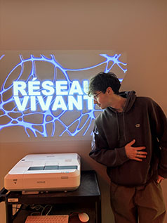

## Réseau vivant

## Collège Montmorency
## Type d'exposition
L'exposition était temporaire et elle avait lieu a l'intérieur dans le grand studio
## Date de ma visite
J'ai été voir l'exposition le 17 mars 2026
## Titre du dispositif
Le titre de ce dispositif est Terminal
## Noms des créateurs
Dana Saavedra-Torrano, Mégane Ranger, Ting Yung Terry Lu, Émeryk Bélisle et Elie Daher
## Année de réalisation
L'exposition a été réalisé en 2025-2026
## Description du dispositif
Terminal est un jeux qui peux acceuillir jusqu'a 6 joueurs, le but du jeu est de collaborer et s'assurer que tout le monde se rende a l'endroit indiqué, le joueur controle son personnage et doit faire attention de ne pas passer la ou quelqu'un est déjà allé sinon il faut recommencer. le contenu est projeté au mur juste devant 6 poufs qui rendent le tout beaucoup plus amusant et confortable
## Type d'installation
C'est une installation qui est a la fois intéractive et immersive car non seuleumemt tu as le controle sur ce qu'il se passe mais il y a des projections et des lumières au dessus de nous qui viennent nous plonger dans ce monde cybernétique.
## Fonction du dispositif
## Mise en espace
## Composantes et techniques
## Éléments nécessaires à la mise en exposition
## expérience vécue

